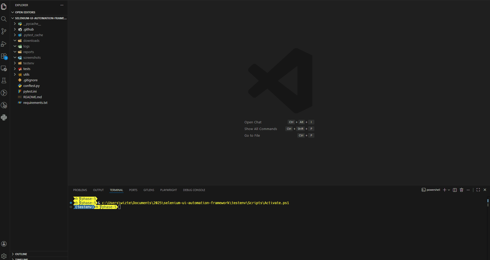
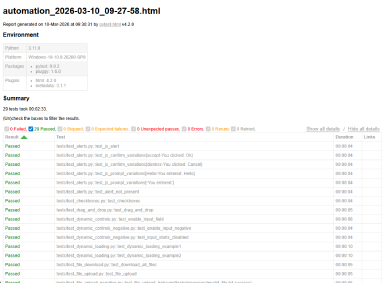

# Selenium UI Automation Framework


## Demo

Parallel Selenium test execution using **pytest-xdist**.



---

A lightweight Selenium automation framework using **pytest** to test  
[`the-internet.herokuapp.com`](https://the-internet.herokuapp.com/) sample pages.

The project demonstrates modern UI automation practices including:

- **Page Object Model (POM) architecture**
- **Reusable helpers and fixtures**
- **Automated HTML reporting with screenshots**
- **Structured logging**
- **GitHub Actions CI integration**

---

## Features

```bash
✔ Selenium WebDriver automation
✔ pytest-based test execution
✔ Page Object Model architecture
✔ Automatic screenshots on test failure
✔ HTML test reports with embedded thumbnails
✔ Structured logging during test execution
✔ GitHub Actions CI pipeline
✔ Tests executed on every push and pull request
```

---

## Table of Contents

- [Project Structure](#project-structure)
- [Setup](#setup)
- [Running Tests](#running-tests)
- [Reporting & Screenshots](#reporting--screenshots)
- [CI/CD Integration](#cicd-integration)
- [Test Coverage](#test-coverage)
- [Helpers](#helpers)
- [Page Objects](#page-objects)
- [Future Improvements](#future-improvements)

---

## Project Structure

```bash
.
├── conftest.py                  # Pytest fixtures (browser setup/teardown, logging, screenshots)
├── utils/
│   └── driver_factory.py        # Driver creation and page load helpers
├── tests/
│   ├── helpers.py               # Common actions (login, toggle_checkbox, wait helpers)
│   ├── pages/
│   │   ├── base_page.py                # BasePage class with wait utilities
│   │   ├── checkboxes_page.py          # Checkboxes page object
│   │   ├── login_page.py               # ""
│   │   ├── alerts_page.py              # ""
│   │   ├── drag_and_drop_page.py       # ""
│   │   ├── dynamic_controls_page.py    # ""
│   │   ├── dynamic_loading_page.py     # ""
│   │   ├── file_download_page.py       # ""
│   │   ├── file_upload_page.py         # ""
│   │   ├── hovers_page.py              # ""
│   │   ├── iframe_page.py              # ""
│   │   ├── login_page.py               # ""
│   │   └── nested_frames_page.py       # ""
│   ├── test_checkboxes.py              # Checkbox tests
│   ├── test_homepage.py                # ""
│   ├── test_alerts.py                  # ""
│   ├── test_drag_and_drop.py           # ""
│   ├── test_dynamic_controls.py        # ""
│   ├── test_dynamic_loading.py         # ""
│   ├── test_file_download.py           # ""
│   ├── test_file_upload.py             # ""
│   ├── test_file_upload_negative.py    # ""
│   ├── test_hovers.py                  # ""
│   ├── test_iframe.py                  # ""
│   ├── test_login_negative.py          # ""
│   ├── test_login.py                   # ""
│   ├── test_nested_frames.py           # ""
│   └── resources/
│   │   ├── example_thumbnail.png       # Report thumbnail
│   │   ├── invalid_file.txt            # regular text file (assuming website doesn't allow .txt uploads)
│   │   ├── large_file.pdf              # extremely large file (assuming website doesn't allow massive file uploads)
│   │   ├── test_file.txt               # another regular text file (assuming website does allow .txt uploads)
├── reports/                            # HTML reports generated by pytest-html
├── screenshots/                        # Screenshots captured on test failure
├── requirements.txt                    # Python dependencies
└── README.md                           # README markdown (this file)
└── .gitignore
└── pytest.ini                          # Pytest configuration
└── requirements.txt                    # required dependencies
```

---

## Setup

```bash
# Clone the repository
git clone https://github.com/zjtheilen/selenium-ui-automation-framework.git
cd selenium-ui-automation-framework

# Create a virtual environment
python -m venv testenv

# Windows
testenv\Scripts\activate

# macOS/Linux
source testenv/bin/activate

# Install dependencies
pip install -r requirements.txt
```

---

## Running Tests

```bash
# Run all tests
pytest

# Run a specific test file
pytest tests/test_login.py

# Verbose output
pytest -v

# Generate an HTML report
pytest --html=reports/automation.html --self-contained-html
```

---

## Reporting & Screenshots

This framework uses **pytest-html** to generate automated test reports.

Features include:

- Test pass/fail summary
- Captured logs per test
- **Automatic screenshots attached to failing tests**
- Inline image thumbnails within the report

Reports are saved to the `reports/` directory.

Example report screenshot:



---

## CI/CD Integration

Tests run automatically using **GitHub Actions**.

Pipeline features:

- Runs on **every push and pull request**
- Uses **Windows runners**
- Installs **Python and Chrome automatically**
- Executes the full pytest test suite
- Uploads the generated **HTML report as a build artifact**

Workflow file location:

```bash
.github/workflows/python-selenium.yml
```

Example workflow:

```yaml
name: Python Selenium Tests

on:
  push:
    branches:
      - "*"
  pull_request:
    branches:
      - "*"

jobs:
  test:
    runs-on: windows-latest

    strategy:
      matrix:
        python-version: [3.11]

    steps:
      - uses: actions/checkout@v4

      - uses: actions/setup-python@v5
        with:
          python-version: ${{ matrix.python-version }}

      - uses: browser-actions/setup-chrome@v1
        with:
          chrome-version: latest

      - run: pytest tests/ --html=reports/automation.html --self-contained-html

      - uses: actions/upload-artifact@v4
        with:
          name: automation-report
          path: reports/automation.html
```

---

## Test Coverage

Current automated test coverage includes:

```bash
✔ Homepage navigation
✔ Login functionality
✔ Checkbox interaction
✔ JavaScript alerts
✔ JavaScript confirms
✔ JavaScript prompts
✔ Multiple input scenarios via parameterized tests
```

---

## Helpers

```python
# login(driver, username, password)
#   Logs into the login page and waits for Secure Area

# toggle_checkbox(driver, index)
#   Toggles a checkbox by index and returns its current state

# wait_for_element(driver, locator)
#   Waits until an element is present

# wait_for_clickable(driver, locator)
#   Waits until an element is clickable
```

---

## Page Objects

Implemented using **Page Object Model (POM) principles**.

```python
# BasePage
#   Provides wait utilities and common browser interactions

# LoginPage
#   Encapsulates login page behavior

# CheckboxesPage
#   Encapsulates checkbox interactions

# AlertsPage
#   Handles JS alerts, confirms, and prompts
```

---

## Future Improvements

```bash
• Add README badges (CI status, Python version)
• Expand Page Object coverage to more pages
• Add configuration file for URLs and timeouts
• Add parallel test execution (pytest-xdist)
• Add multi-browser support
• Integrate Allure reporting
```
